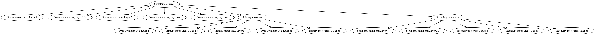

# Brain Atlas Toolkit

This package is intended as a toolkit for manipulating hierarchical brain atlases. For example, the Allen Mouse Brain Atlas has a parent-child ontology of this structure:

```python
{
 "id": 997,
 "acronym": "root",
 "name": "root",
 "graph_order": 0,
 "parent_structure_id": null,
 "children": [
  {
   "id": 8,
   "acronym": "grey",
   "name": "Basic cell groups and regions",
   "graph_order": 1,
   "parent_structure_id": 997,
   "children": [
    {
     "id": 567,
     "acronym": "CH",
     "name": "Cerebrum",
     "graph_order": 2,
     "parent_structure_id": 8,
     "children": [
     ...
```

## Requirements

- python>=3.7
- A system-wide installation of graphviz: https://www.graphviz.org/ if you are going to use any of the visualization tools in this package.

## Examples

### Load a custom brain atlas from JSON file
```python
from brain_atlas_toolkit import graph_tools
import json

json_file = "allen_ontology.json"
with open(json_file,'r') as infile:
	ontology_dict = json.load(infile)
```

Note that this JSON file must have the structure of the example ontology shown above. The minimal set of keys in each element are: 
- id
- name
- parent_structure_id

### Initialize ontology graph
```python
ontology_graph = graph_tools.Graph(ontology_dict)
```

### Get all progeny (a.k.a. descendents or subregions) of a region of interest returned in a flattened list

```python
ontology_graph.get_progeny('Somatomotor areas')
```
which returns:
```
['Somatomotor areas, Layer 1', 'Somatomotor areas, Layer 2/3', 'Somatomotor areas, Layer 5', 'Somatomotor areas, Layer 6a', 'Somatomotor areas, Layer 6b', 'Primary motor area', 'Primary motor area, Layer 1', 'Primary motor area, Layer 2/3', 'Primary motor area, Layer 5', 'Primary motor area, Layer 6a', 'Primary motor area, Layer 6b', 'Secondary motor area', 'Secondary motor area, layer 1', 'Secondary motor area, layer 2/3', 'Secondary motor area, layer 5', 'Secondary motor area, layer 6a', 'Secondary motor area, layer 6b']
```

### Get the parent name of a region of interest
```python
ontology_graph.get_parent('Somatomotor areas')
```
which returns:
```
Isocortex
```

### Get the integer id of a region of interest
```python
ontology_graph.get_id('Somatomotor areas')
```
which returns:
```
500
```

### Get the acronym name of a region of interest
```python
ontology_graph.get_parent('Somatomotor areas')
```
which returns:
```
MO
```

### Print a branch of the ontology 

```python
ontology_graph.print_branch('Somatomotor areas')
```
which returns
```
 0 Somatomotor areas
	 1 Somatomotor areas, Layer 1
	 1 Somatomotor areas, Layer 2/3
	 1 Somatomotor areas, Layer 5
	 1 Somatomotor areas, Layer 6a
	 1 Somatomotor areas, Layer 6b
	 1 Primary motor area
		 2 Primary motor area, Layer 1
		 2 Primary motor area, Layer 2/3
		 2 Primary motor area, Layer 5
		 2 Primary motor area, Layer 6a
		 2 Primary motor area, Layer 6b
	 1 Secondary motor area
		 2 Secondary motor area, layer 1
		 2 Secondary motor area, layer 2/3
		 2 Secondary motor area, layer 5
		 2 Secondary motor area, layer 6a
		 2 Secondary motor area, layer 6b
```

### Print a branch of the ontology and control the depth of the tree
```python
ontology_graph.print_branch('Somatomotor areas',stoplevel=1)
```
which returns
```
 0 Somatomotor areas
	 1 Somatomotor areas, Layer 1
	 1 Somatomotor areas, Layer 2/3
	 1 Somatomotor areas, Layer 5
	 1 Somatomotor areas, Layer 6a
	 1 Somatomotor areas, Layer 6b
	 1 Primary motor area
	 1 Secondary motor area
```
The default stoplevel value is -1, which means print the entire tree to max depth.

### Visualize a branch of the ontology
```python
digraph = ontology_graph.visualize_graph('Somatomotor areas',level=2)
digraph.format='png' # control the image type; supports png, pdf and other formats
digraph.view()
```
The last line will save and then open up an image in your default image viewer application. The image should look like this (click image to view zoomed in version):


For full documentation of the `digraph` object, see the graphviz Python API documentation: https://graphviz.readthedocs.io/en/stable/
